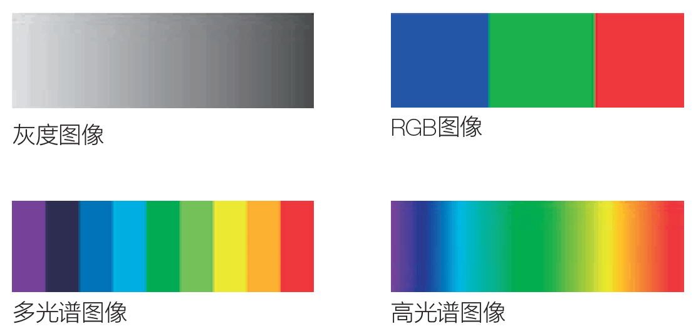
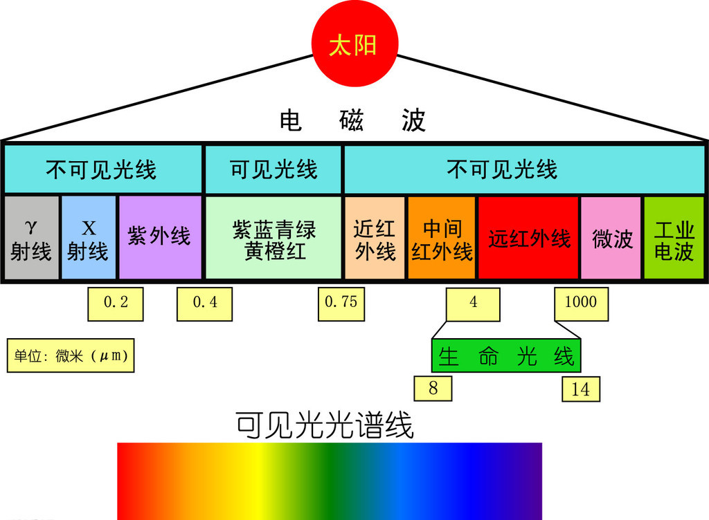
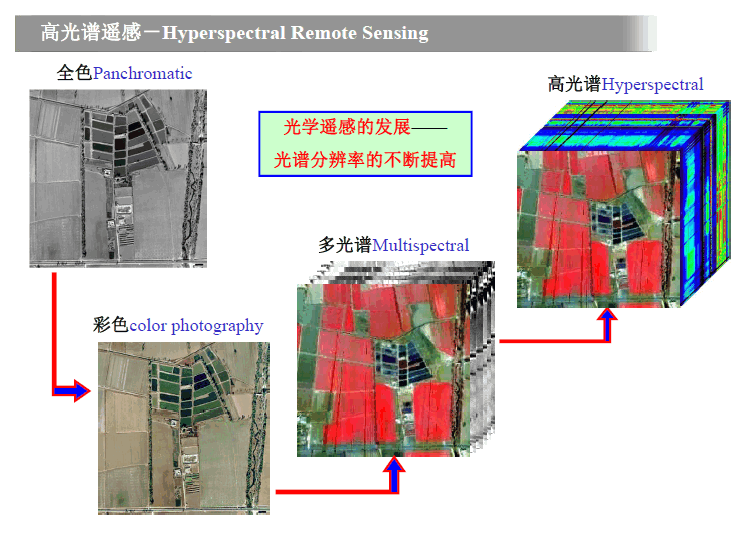
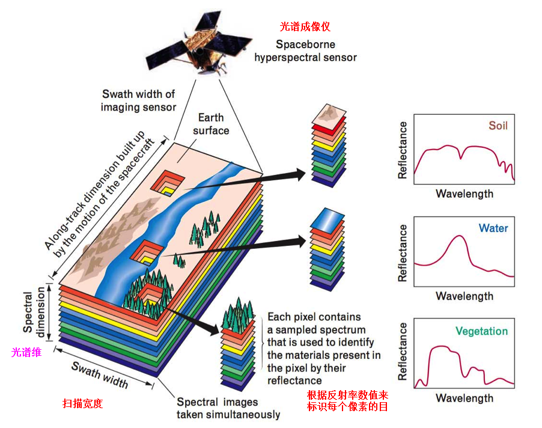

# 高光谱图像的那些事儿

## 0） 前言（RGB Image —— “大骗子”）
现实世界中真真假假的事物太多（比如：假的人民币，假的艺术品，塑料制作的苹果......）,在当今的计算机视觉领域，RGB图像的处理和应用无论是在日常生活中，还是工业级的应用中都占据着主导性的地位。殊不知另外一种更具“杀伤力”的图像类型正悄悄进入着人们的视野 —— 高光谱图像。

* Faster RCNN， YOLO算法会把图片中的真的苹果，塑料质的苹果都检测和分类为苹果，真假不分这样真的好吗？

* 真的和假的艺术品、人民币，可以通过图片来自动分析识别出来吗？

**未来的AI需要的是更加智能，更加安全的AI，因此，需要透过现象，透过表象，去探索更深的，更重要的本质。RGB图像“无情的欺骗”了世人的眼睛，Hyperspectral Spectral Image（HSI，高光谱图像）才是未来的真爱。**

## 1） 与常见图像的区别
### 1.1 一图胜千言，看图思考  

由此可见，高光谱图像在获取到的光谱（又叫通道）信息更加多样，不局限与RGB三个通道，而是覆盖到了电磁波谱的多个连续的波段。其实现实生活中最常见的RGB图获取的只是众多波段中的三个：

### 1.2 光谱范围示意图

### 1.3 高光谱图像示意图

## 2）高光谱图像数据构成
高光谱数据是三维数据，有时称为图像块或超级数据立方体（Super Hypercube）。其中的二维信息的图像像素的横纵坐标（x 和 y），第三维是波长信息（λ）。

* 图像维 ：与一般的图像相似。
* 光谱维 ：对应高光谱图像的 **每一个像元，均有一个连续的光谱曲线**。(比如：下图中土壤，水，植被的曲线示意图)

## 3）高光谱在识别方面的优势

**高光谱图像集样本的图像信息与光谱信息于一身。图像信息可以反映样本的大小、形状、缺陷等外部品质特征，由于不同成分对光谱吸收也不同，在某个特定波长下图像对某个缺陷会有较显著的反映，而光谱信息能充分反映样品内部的物理结构、化学成分的差异。所以，高光谱图像能够反映综合品质。不同物质间千差万别的光谱特征和形态利用高光谱影像技术可以很精细的得到明显的反映。**

* **光谱分辨率高、波段众多，能够获取地物几乎连续的光谱特征曲线，并可以根据需要选择或提取特定波段来突出目标特征；**

* **同一空间分辨率下，光谱覆盖范围更宽，能够探测到地物更多对电磁波的响应特征；**

* 波段多，为波段之间的相互校正提供了便利；

* **定量化的连续光谱曲线数据为地物光谱机理模型引入图像分类提供了条件；**

* 包含丰富的辐射、空间和光谱信息，是多种信息的综合载体。

## 4）高光谱在识别方面的困难：

* **波段多、波段间的相关性高，因此分类需要的训练样本数目大大增多，往往因训练样本不足导致得到的训练参数不可靠(维数灾难)；**

* **数据量大，图像包含几十个到上百个波段，数据量是单波段遥感图像的几百倍；数据存在大量冗余，处理不当，反而会影响分类精度；**

* 对高光谱图像的分类一方面要求更高的光谱定标和反射率转换的精度，另一方面又因为成像机理复杂，数据量巨大而导致对图像数据预处理困难，包括大气矫正、几何校正、光谱定标和反射率转换等；

* 针对常规遥感的处理模型和方法不能满足高光谱图像分类的需要。主要问题之一是统计学分类模型的参数估计问题，其对光谱特征的选择要求很高。

## 5） 文献参考

* [BLOG： 高光谱遥感图像相关知识梳理大全](http://blog.csdn.net/u010976453/article/details/72416039)

* [PDF： 高光谱成像应用示例](http://img2.29ep.com/Down/20120705/201207050528052453.pdf)

* [PDF： 高光谱成像技术及应用介绍](http://file.yizimg.com/344760/2013042309373282.pdf)

* [PDF： 中国科学院遥感与数字地球研究所（张兵）](http://cre.ucas.ac.cn/upload/files/20151106/20130719-%E9%AB%98%E5%85%89%E8%B0%B1%E9%81%A5%E6%84%9F-%E5%BC%A0%E5%85%B5.pdf)

## 机遇与挑战并存，洞察未来需要 ......

