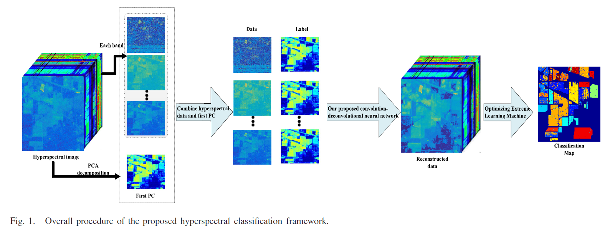
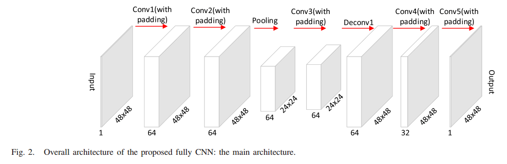
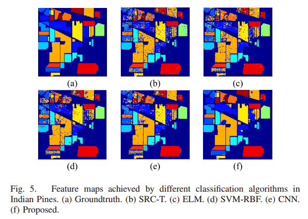
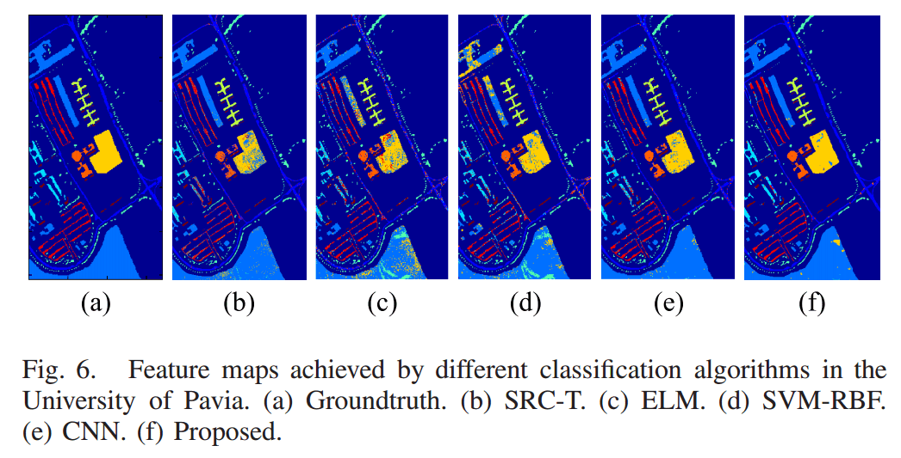
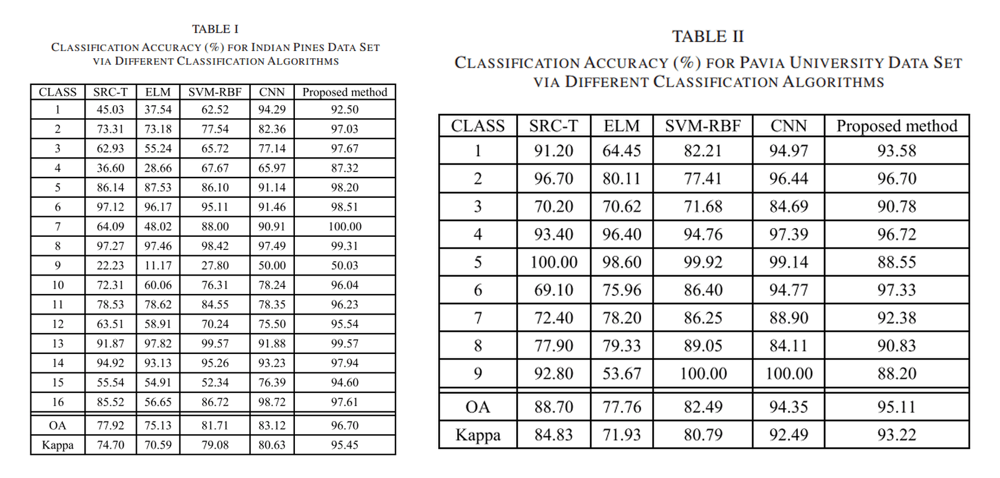

    高光谱图像快速了解(Hyperspectral_Image_Introduction.md)

# Classification of Hyperspectral Imagery Using a New Fully Convolutional Neural Network

## 1. Abstract
With success of convolutional neural networks (CNNs) in computer vision, the CNN has attracted great atten-tion in hyperspectral classification. Many deep learning-based algorithms have been focused on deep feature extraction for classification improvement. In this letter, a novel deep learning framework for hyperspectral classification based on a fully CNN is proposed. Through convolution, deconvolution, and pooling layers, the deep features of hyperspectral data are enhanced. **After feature enhancement, the optimized extreme learning machine (ELM) is utilized for classification**. The proposed framework outperforms the existing CNN and other traditional classification algorithms by including deconvolution layers and an optimized ELM. Experimental results demonstrate that it can achieve outstanding hyperspectral classification performance.

## 2. Framework and FEFCN Architecture

### 2.1 Framework

### 2.2 FEFCN Architecture

## 3. Implementation Details

* Training data: 48*48 overlapped patches, stride: 15

* Caffe platform with NVidia Tesla K80 GPU

* Base learning rate is 0.001.

## 4. Results

### 4.1 Classification Maps

### 4.2 Classification Accuracy (%)

### 5. Paper Link or Cite

* [Paper： Click Here](http://ieeexplore.ieee.org/document/8249752/)  

* [DOI: 10.1109/LGRS.2017.2786272](http://ieeexplore.ieee.org/document/8249752/)

        @article{li2018classification,
          title={Classification of Hyperspectral Imagery Using a New Fully Convolutional Neural Network},
          author={Li, Jiaojiao and Zhao, Xi and Li, Yunsong and Du, Qian and Xi, Bobo and Hu, Jing},
          journal={IEEE Geoscience and Remote Sensing Letters},
          year={2018},
          publisher={IEEE}
        }

